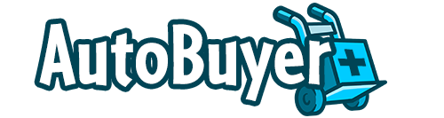

  

# [AutoBuyer+ / Neopets Shop & Attic Highlighter & Autobuyer Crack]()
> By [Unovamata](https://github.com/Unovamata "Unovamata").

**Table of Contents**

+ [How to install](#how-to-install)
+ [Tips](#tips)
+ [New & Included Features](#new--included-features)

## How to install
- Download the [Latest Version of AutoBuyer+](https://github.com/Unovamata/AutoBuyerPlus/releases) from the releases page and save these files to any location on your computer.
- Open your Chronium based browser.
- Click on the three dots in the upper-right corner of the screen to open the Chrome menu.
- Select "More tools" from the drop-down menu, then click on "Extensions."
- Make sure the "Developer mode" option is turned on by toggling the switch in the upper-right corner of the screen and refresh the tab.
- Extract the downloaded files from the compressed .ZIP / .RAR package.
- Click the "Load unpacked" button in the upper-left corner of the screen inside the "Extensions" menu.
- In the file explorer window, navigate to the location where you saved the extension files and select the folder containing them.
- Click the "Select Folder" button to install the extension.
- The extension will now appear in your list of installed extensions in your Chronium based browser.
- Navigate to the options page the AutoBuyer+ has and configure the parameters you want to use after acknowledging the warning that triggers as soon as the extension is installed.

> **Use the tool at your own risk, do not be greedy.** Research legitimate times and adjust settings based on your ping. Lower the Autobuyer's times if you lose out on too many items, but use the tool responsibly.

## Tips

- Read the Wiki's User Manual pages.
- Read the FAQs that come along with the extension in the **Tools > Github > FAQs** for more information.
- No warnings nor bans have been reported with the usage of AutoBuyer+.
- Firstly, it is essential not to be greedy while restocking. Do not go Auto-Buying for more than 8 hours at a stretch as it may draw Neopets' attention towards your account. Do not overdo it.
- In case you fail to buy an expensive item, do not worry. It is better to keep a low profile and aim for less profitable items. It is not what you stock but how many items you stock. You can choose shops with high profitability or low competition.
- Before activating the ABer, make sure to check all your options carefully. Most of the options are set in milliseconds, so it is best to be cautious while setting them up.
- To search for items that you want to buy from specific shops and create your custom item sniping list, you can use JellyNeo's item databases and play around with the filters their database offers.

## New & Included Features

- Cracked the multiple paywalls the extension had.
- Cleaner interfaces with better navigation.
- [Neon](https://chrome.google.com/webstore/detail/neon/hpbfhmapaaocfnpmbikclmeokcgpljnm "Neon") extension integration for quicker SW searches.
- User's shop auto-pricer.
- Shop restock timer.
- Daily update checker.
- Better "Quickstock."
- Save and load configuration presets.
- "Almost Abandoned Attic" AutoBuyer.
- AutoBuyer+ Mail updates on development.
- Wait times to circumvent 5 second rule desyncs.
- Detect and only restock on "Shop Clears".
- Auto "Kitchen Quest" solver and tracker with analytics.
- Improved and intelligent haggling system.
- "Restock List" generator.
- Bypass "Confirm" pop-up when buying items from main shops.
- Informative analytics about your AutoBuying and selling activities.
- Human-like AutoAttic refresher.
- Highlighting instead of autobuying
- Full autobuying with auto-clicking confirm
- Captcha annotation with auto-clicking captcha
- Purchase history page with rarity & estimated profits
- Manual restock list or automatic item database
- Refresh intervals and stocked status check
- Alert system with sound and text-to-voice alerts
- Second most valuable item option for low internet connection
- Scheduled operation between certain hours
- Ability to view current item database
- Minimum profit percentage and NPS threshold for purchasing items
